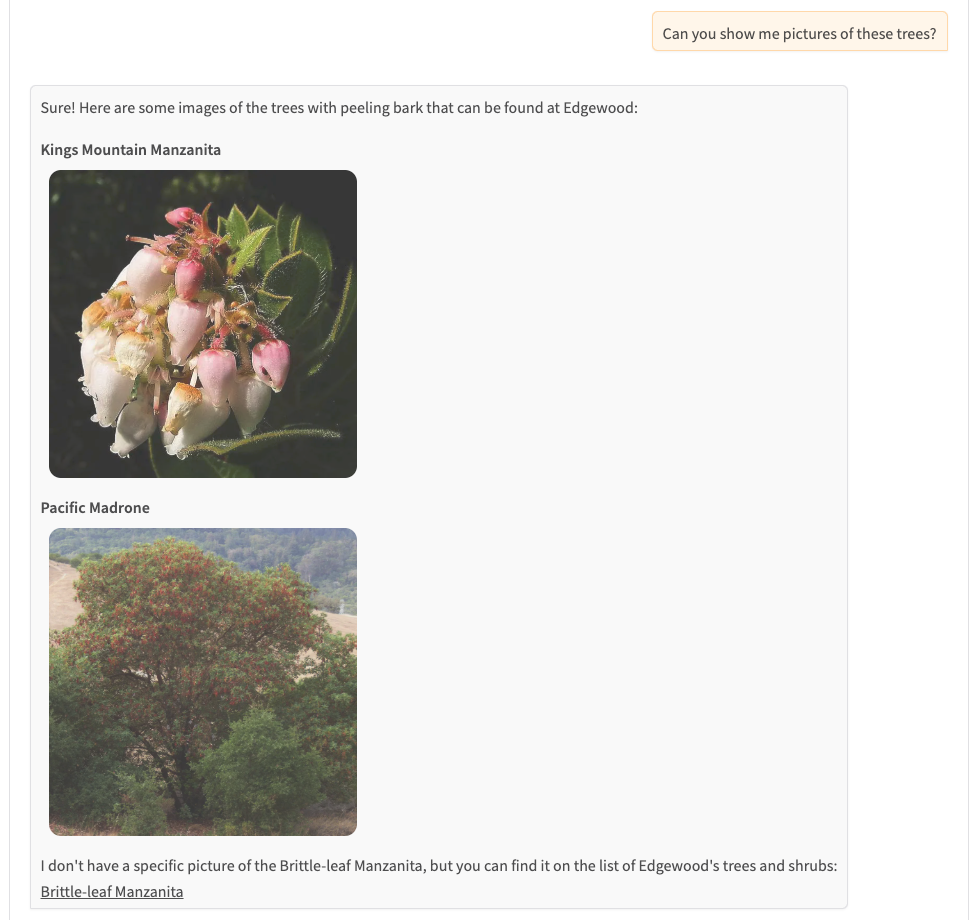

# Edgewood Park Chatbot

The Edgewood Park Chatbot is powered by a RAG system built from the [Friends of Edgewood](https://friendsofedgewood.org/) website, and is deployed on [HuggingFace Spaces](https://huggingface.co/spaces/random-tesseract/edgewood), free for all to try.

The *Friends of Edgewood* is all-volunteer, donor-funded, non-profit that supports the Edgewood County Park and Natural Preserve in San Mateo Country, California.  Their website includes a field guide of plant species and wildlife found in the park, descriptions of
hiking trails, and volunteer opportunities.

The chatbot was built using LangChain, makes use of Google Gemini models and embeddings, and has a Gradio frontend.  Firecrawl was used to crawl and process web data, which is stored in a Qdrant vector database.  The chatbot features chat history and responses that include images and links.

